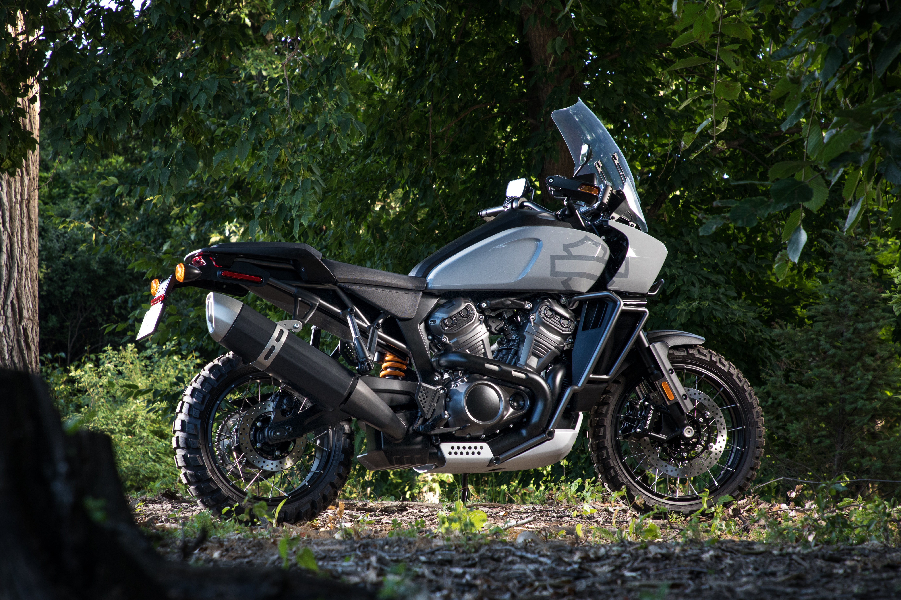

## Setting up a theme switcher

I love to add the ability to toggle light and dark mode on my new website. Theme Switcher inspiration from: https://github.com/MaximeHeckel/gatsby-theme-maximeheckel

followed example to setup the code for using global styles, stumbled upon this comment of trying to setup theme on a higher level as suggested in Emotion docs. User was explaining difficulty in getting theme to show in production, which led me to research the theme switcher that he had build

### This is heading level 3

followed example to setup the code for using global styles, stumbled upon this comment of trying to setup theme on a higher level as suggested in Emotion docs. User was explaining difficulty in getting theme to show in production, which led me to research the theme switcher that he had build

followed example to setup the code for using global styles, stumbled upon this comment of trying to setup theme on a higher level as suggested in Emotion docs. User was explaining difficulty in getting theme to show in production, which led me to research the theme switcher that he had build

#### This is heading level 4

followed example to setup the code for using global styles, stumbled upon this comment of trying to setup theme on a higher level as suggested in Emotion docs. User was explaining difficulty in getting theme to show in production, which led me to research the theme switcher that he had build

##### This is heading level 5

followed example to setup the code for using global styles, stumbled upon this comment of trying to setup theme on a higher level as suggested in Emotion docs. User was explaining difficulty in getting theme to show in production, which led me to research the theme switcher that he had build

followed example to setup the code for using global styles, stumbled upon this comment of trying to setup theme on a higher level as suggested in Emotion docs. User was explaining difficulty in getting theme to show in production, which led me to research the theme switcher that he had build

###### This is heading level 6

followed example to setup the code for using global styles, stumbled upon this comment of trying to setup theme on a higher level as suggested in Emotion docs. User was explaining difficulty in getting theme to show in production, which led me to research the theme switcher that he had build

## New heading level 2

followed example to setup the code for using global styles, stumbled upon this comment of trying to setup theme on a higher level as suggested in Emotion docs. User was explaining difficulty in getting theme to show in production, which led me to research the theme switcher that he had build

