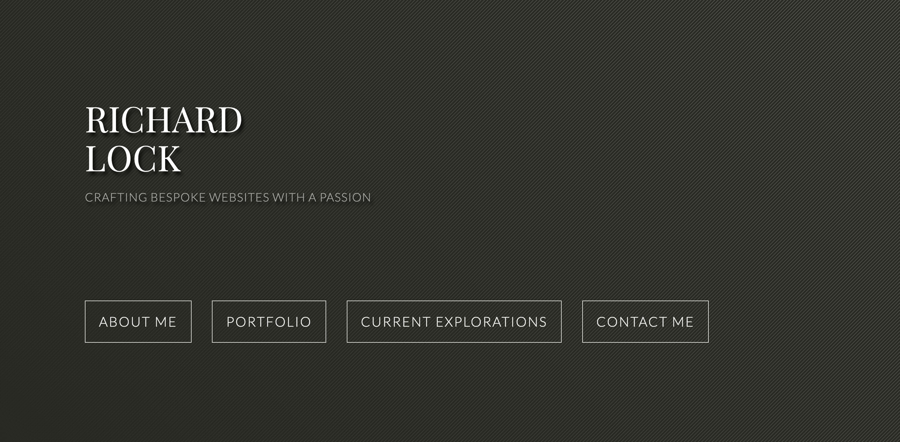

My personal website redesign has been a long time coming. Reviewing  Github repo's commit history showed that I made the first commit in March 2019. I can't believe that it has taken me close to 3.75 years to get my redesign to a launch state! 🙀

## Why did I need to update my working portfolio website?

The impetus for my redesign effort was partly due to of my job hunt process. It all started when I was preparing for my eventual move from the US to Canada. I wanted to showcase my skill set being a front-end developer who is intimately knowledgeable with vanilla Javascript (JS), has experiences with JS frameworks such as React, and has used JS-based static site generators such as Gatsby. Most of all I just wanted to challenge myself and showcase my development skills within the Javascript ecosystem.

There were also aspects of my previous website that I felt were cumbersome and difficult to update as my role changed from a Front-end developer to a full-stack role. There weren't many website redesign projects that were showcase-able or inspiring. A large portion of my job was creating piece meal features for existing sites, new pages, or troubleshooting issues as they arise across myriad of client websites. Hence maintaining a portfolio site without new showcases to display no longer make sense.

## Did it really take that long?

3.75 years? You might think, surely as a long-time professional web developer, with all the skills and experience, it shouldn't take that long.

Unfortunately, it did. Not for the lack of effort but for the following reasons: there was a period of transition and instability as I was acclimatizing from my small-town move to a large city life and a new job at an agency. There was also the amount of new knowledge that I have to pick up in my new role. Over time, the importance of my personal website redesign efforts took a backseat as other life priorities and responsibilities demanded my attention.

Slowly, I began to able to carve out little chunks of time and headspace to work on my website again. The difficulty with any development is context switching and  time lapse. The longer the lapse, the more time it took for me to deal with the cold start and remember where I left off and how things were set up, and where my todo list is 👻. Don't let anyone fool you into thinking that this is not a norm. Of course there are always exceptions to the rule (e.g. if you have a photographic memory) but for the most of us, we struggle to remember what we had for dinner two nights ago. Context switching is also another thing that was a surmountable but time consuming obstacle. My day job uses a different stack so to reorient myself  does take time.

Another reason that came into play included my unrealistically high  expectations over the quality of work. Good work takes time. But it is also a double-edged sword. Having  started out as a front-end developer at an in-house agency, we had a liberal amount of time to nitpick at the quality of our own work and fine tune our code and designs so that all aspects of our work such as accessibility, performance, excellent UX/UI are met. Thus, the setting of a high bar has become ingrained in me. I have since come to terms with a need of balance between quality and meeting tight deadlines after working at an agency. This has helped  me cut back the amount of launch features that I had planned for the site and set the baseline for this website. To this day I regretted the amount of time I spent on figuring out features and robustness that are unlikely to be used at launch. A good example of this is setting up my theme context and Tailwind configuration to have an option for a seasonal theme hidden inside of my site's theme toggle functionality.

Another danger of spreading the work over such a long period of time is that taste and ideas change over time. I have scrubbed quite a few ideas and rethink through features a couple of times to arrive at this launch iteration. I have also refactored portions of the code a couple of times as I picked up new paradigms, concepts, and simply better way of doing things that will avoid potential problems in the long run. Another major time-related pitfall is that the dependencies have been updated multiple times over the course of my development. I had to peg my development version on older version of Gatsby and Tailwind as newer versions introduced breaking changes that I simply couldn't find time to refactor/resolve.

## Was it worth it?

It depends. Over the extended period of time working on my personal website redesign, I have coded up features and played with ideas that I would have not been able to implement at my day job. I have also built advanced features that I couldn't bake into my launch because there were parts that just couldn't work for what I was trying to accomplish. It was also refreshing having to build my own blog functionalities such as pagination, the ribbon animation and implementing a working table of contents on individual blog posts. It was even more rewarding when I was able to transfer my React experience to my day job. Working on the Gatsby and React stack have also made me more informed and aware of developments in the JS world as I moved into a lead developer role and began steering my agency's service offerings towards a more javascript-based ecosystem.

The sad part: another major reason for the redesign is centered around the goal of making my site a more active part of my development career. Between the inception of this project till launch, I have come across a lot of interesting way of doing things and solving interesting problems that I truly wanted to capture for my blog but weren't able to.  However, now that my site is finally ready, I look forward to adding my thoughts of the day/week to it!

I have set up my old portfolio site at a subdomain should you ever be interested in visiting it: [archive.iamrichardlock.com](https://www.archive.iamrichardlock.com/)

