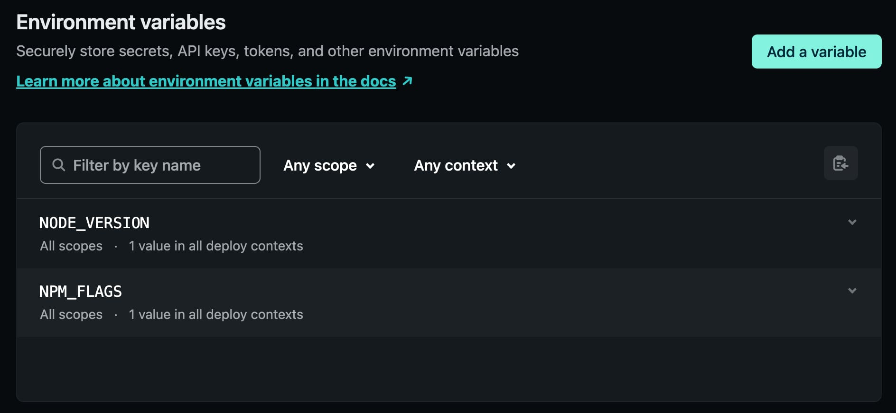

I am so glad that I am finally able to push my website redesign across the finish line and launched it right around the corner of the new year.

As mentioned [in this post], I pegged my development of Gatsby at version 2. It was a conscious decision since it will take too much effort from me to try to update and deal with the breaking changes while trying to finish building my site, since I can only work on it for short amount of time with large lapses in between.

Despite my excitement that the site was done and fully build-able locally with gatsby build , Netlify was not able to deploy my code. It got hung up on some error generating WebP images from my sample posts.  I asked for assistance in the support forums and as I suspected and to my dismay, they requested that I update my Gatsby version. Hence began my long and painful journey of migrating towards the latest version which is v5.3.1

## Trials and Errors

As a seasoned developer, I knew migrating across multiple major releases in one go was bound to be a journey through purgatory. Foolishly, I was hoping for some miracle. The error messages that I received were non-sensical and vague. In the end, I listened to my gut and went with a stepped migration instead.

The toughest part of the entire migration experience was from v2 to v3. There were quite a bit of breaking changes and errors that I had to figure out and in my code, Gatsby, and the plugins that I have installed. Since I am only using Gatsby for my static blog site, I was spared a lot of the more complicated fixes. The migration from v3 to v4 and subsequently v5 were way smoother. I used the codemods provided by Gatsby to scan my code and made the necessary replacements. Thank goodness for the opinionated way of doing things which also means by following the prescribed convention, code patterns can easily be detected and replaced.

There was a weird behavior in v4 where making changes during gatsby develop would alter the priority of the loaded stylesheets. The Webpack combined CSS file (commons.css) would move from its original page load position in the head element to the end of the head element on save. This caused some of the global styles that I wrote inside of Emotion theme to get overwritten by resets that were inside of Tailwind's preflight CSS. It took me hours to research the issue and attempt fixes. These two posts described what I was fixing but apparently the fixes were already in v2, which got me very confused:
- [Stop code splitting CSS?](https://github.com/gatsbyjs/gatsby/issues/11072)
- [Order of styles](https://github.com/gatsbyjs/gatsby/issues/1836)

As a band aid, I decided to move the global element styles in Emotion theme into Tailwind via TW custom plugins. This solved some of the most visible issues with typography resets but not all. Finally I decided to just push through and perform the final version migrate hoping that this issue no longer exists in the Gatsby v5. Thankfully this was indeed the case. The issue was gone despite still observing the commons.css file still being reordered to the last child of the head element.  My guess is that some configuration of Webpack chunk loading was changed.

At time of this writing,  the `gatsby-plugin-purgecss` is the only plugin in my package.json that still relies on Gatsby v4. To solve for this dependency issue, I have to set NPM_FLAGS environment variable in Netlify to install with the `--legacy-peer-deps` flag. Gatsby v5 also introduced dependency for Node v18. To let Netlify know which version of Node to use, I can set the version number inside of the NODE_VERSION flag.

## Celebrate 🎉
Now that the site is launched, I will be actively adding new content over the months.  It will also be a constant journey of development as I fine tune the existing features and introduce new ones. Despite the chore-ish nature of it, I look forward to it as simply a constant challenge and state of experimentation and learning and doing things that is difficult to accomplish in a work environment. So here is to an interesting but fun 2023 and thank you kind reader for reading this far.

You can still view my old portfolio site at this address: [archive.iamrichardlock.com](https://www.archive.iamrichardlock.com/)

