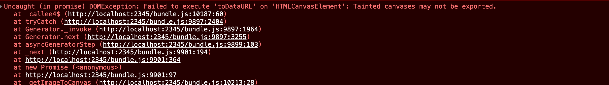

I worked on a request last week, where the client asked if we could provide a fallback static image for the 3D product visualizer that we previously integrated for them. Built using React, this 3D product visualizer application allows users to view a 3D product model and customize its features in real time. Providing a static image in the event a 3D model file is not present make sense and sounds easy to implement. However, as we know in the world of development, more often than not, things are rarely straightforward.

## The complications
Sourcing the static image for each product wasn't difficult. I can easily pass in the image's external URL to the data used in initializing the React application. The complexity was that this request is supposed to be a temporary stop gap solution. In the application, the 3D model in the canvas element is resized and converted into base64 data URI and used in two places:
1. in a post request to an endpoint where its used for PDF generation
2. as a form input string value for saving a thumbnail snapshot of the user's custom product configuration

Since the goal of this change is only a stop gap solution, I intend to preserve as much of the original functionality and code design as possible by making only minimal and necessary changes that will be easy to remove when time comes. To preserve the functionality of the above two features, my solution was to simply adjust the existing resize function to accept a new image element in addition to the preexisting canvas element. Since the resize function draws its arguments onto a separate new fix-sized canvas context, converting it to base64 URI is pretty straightforward using canvas.toDataUrl().

However, an issue occurred after the resizing function has generated a new painted canvas and a subsequent attempt was made to convert the new canvas into a data URI:

## What is a tainted canvas
This is the first time I encountered this error so I looked it up. According to MDN, a tainted canvas happens when an attempt is made to draw image or data from an origin without Cross Origin Resource Sharing (CORS) approval onto a canvas. In my case, my static image comes from a file storage subdomain where CORS header wasn't set.

Why is tainted canvas a thing? According to MDN, pixels in a canvas's bitmap can come from a variety of sources, including images or videos retrieved from other hosts, it's inevitable that security problems may arise. Imagine a malicious script that secretly duplicate any images on a page including a QR code used for logging into a secured application and sent elsewhere, that would be a concern.

<figure class="u-blockquoteWrapper">
    <blockquote cite="https://developer.mozilla.org/en-US/docs/Web/HTML/CORS_enabled_image#security_and_tainted_canvases">
        
As soon as you draw into a canvas any data that was loaded from another origin without CORS approval, the canvas becomes tainted. A tainted canvas is one which is no longer considered secure, and any attempts to retrieve image data back from the canvas will cause an exception to be thrown.

    </blockquote>
    <figcaption>— <a href="https://developer.mozilla.org/en-US/docs/Web/HTML/CORS_enabled_image#security_and_tainted_canvases">Mozilla Developer Network article on Tainted Canvas</a></figcaption>
</figure>

## How to get around a tainted canvas
The suggested solutions that I have came across include:
1. setting the [Access-Control-Allow-Origin](https://developer.mozilla.org/en-US/docs/Web/HTTP/Headers/Access-Control-Allow-Origin) header on the server that hosts the asset
2. set the image element's crossOrigin attribute to anonymous
3. Or use a proxy on your website server to [proxy image requests to the 3rd party server](https://www.unblu.com/en/docs/latest/knowledge-base/html-tainted-canvas-limitation.html#is-there-a-workaround).
4. If you are using html2canvas package, [there's a `useCors` boolean option](https://stackoverflow.com/a/58484441/10134767)

## How did I resolve it?
In my situation, none of the above solutions shouts temporary fix to me. Setting the  Access-Control-Allow-Origin header will require me to get in touch with client's server admin team and probably looking at a few back and forth. That's already a pain.

## Reassessing my needs
1. Data URI in a post request to an endpoint where its used for PDF generation
	- After reviewing how the dataURL is being used by the HTML template used for PDF generation (WkHtmlToPdf), the dataURL is set as the src of an image element. Wait a sec, why don't I just simply post the external image URL and it will be set in the right spot and used in the correct way to retrieve the external image.
2. Data URI as a form input value for saving a thumbnail snapshot of the customers custom product configuration
	- This was a little more tricky. The thumbnail is used on a saved projects page. When I reviewed the saved project's view markup and its controller logic, I noticed that the controller was still retrieving a static image of each model (the legacy functionality) and the view checks to see if the model has a saved 3d thumbnail data URI. If not, the legacy static product image is set as the image src. Perfect! I just need to make sure nothing is sent for the thumbnail input value on form submission.

In the end, my actual solution was even simpler than my original one. However I did learn about tainted canvas even though I didn't have to solve for it, so it wasn't a complete waste of time.

