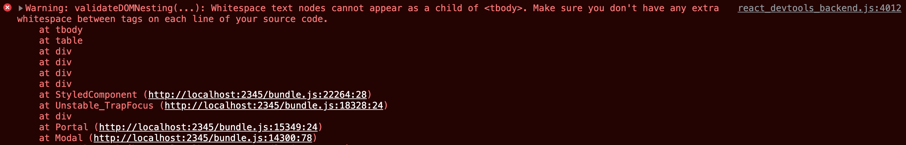
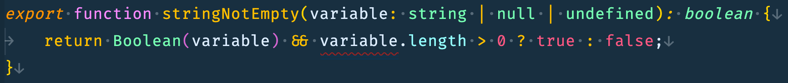
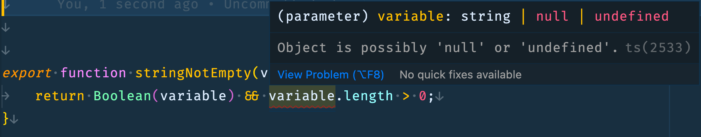

The KISS principle (Keep it Short and Sweet) can be applied to many things. This includes communication to enhance the effectiveness of the message the author tries to convey. In programming, the KISS principle applies just as well. We encourage the writing of clear and effective code so that it is easily understood and maintainable by others in the future. Once in awhile, we went overboard with simplification and didn't realize the unintended consequences of our efforts to minimize the lines of code.

Awhile back, while I was working on a client ticket for a React application, and I noticed a warning inside of the browser's console log:


This warning message only shows up when a dialog box appears so it wasn't caught and fixed early on. The warning itself is easily understandable but locating the source was a little more challenging. I inspected the modal's rendered table markup in the browser inspector and there wasn't any empty text nodes. Next, I reviewed the modal component's code and still, I couldn't find where empty text nodes can possibly appear. In fact, I even had a utility function for checking whether a variable is empty before outputting the JSX element displaying the table. That is really odd!

```javascript
{stringNotEmpty(currentColorTex.content) && (<tr>
    <th>Content:</th>
    <td>{currentColorTex.content}</td>
</tr>)}
```

Next up I tried the process of elimination by removing all the table rows and columns inside the modal and re-adding back to see where the warning re-appears. Oddly enough, the warning appeared as I re-added a table row where the variable is empty but my utility method should have caught it.

## Debugging the Utility Method
Here is the code utility function itself:

```javascript
export function stringNotEmpty(variable:string|null|undefined) {
    return variable && variable.length>0;
}
```

Simple enough, but to the experienced eye, the code is flawed. How so? When an empty string argument is passed in, the return is surprisingly the empty string itself. This is the very nature of short-circuit evaluation. When the variable argument itself is falsy, the evaluation will stop at the left hand side of the && operator and simply return the first set of evaluation, in this case, the empty string variable itself and not a boolean value!

Also, as you have noticed, Typescript is used here but it didn't give us any errors because our intention here wasn't clear enough about our intended use case.

## The solution: Be explicit about the return type
There are more than one way that this can be resolved. I will first showcase the one that I didn't use followed by the solution that I ended up with. Both methods involved indicating the return type at the function declaration level.

1. Using Boolean to explicitly type coerce our argument:
	By using the Boolean constructor to perform a type coercion on a non-boolean argument (or simply use the double not !! operator) and indicating the return type in the function declaration:
    
    But as you can see Typescript is not happy about this. Let's hover over the error and see what Typescript has to say:
    
    That makes sense because variable can be null or undefined and it will not have a length property, so now we have to do some additional type narrowing:
```javascript
export function stringNotEmpty(variable:string|null|undefined):boolean {
    return Boolean(variable) && typeof variable === 'string' &&  variable.length > 0;
}
```
2. Explicitly return boolean values:
    - In this version of the solution, I explicitly indicate what I wish to return via a ternary operator and indicate the return type in the function declaration.
```javascript
export function stringNotEmpty(variable:string|null|undefined): boolean {
    return variable && variable.length > 0 ? true: false;
}
```

## Final Thoughts
I am impartial to either solutions and as a matter of preference, I ended up with solution 2 as it was easier to read although solution 1 does have runtime type checking. The lesson here is that even as developers become more experienced and use more advanced techniques, paying attention to (or trying to remember) the basics is important as it can often trip us up with something as basic as the mistake I made above.